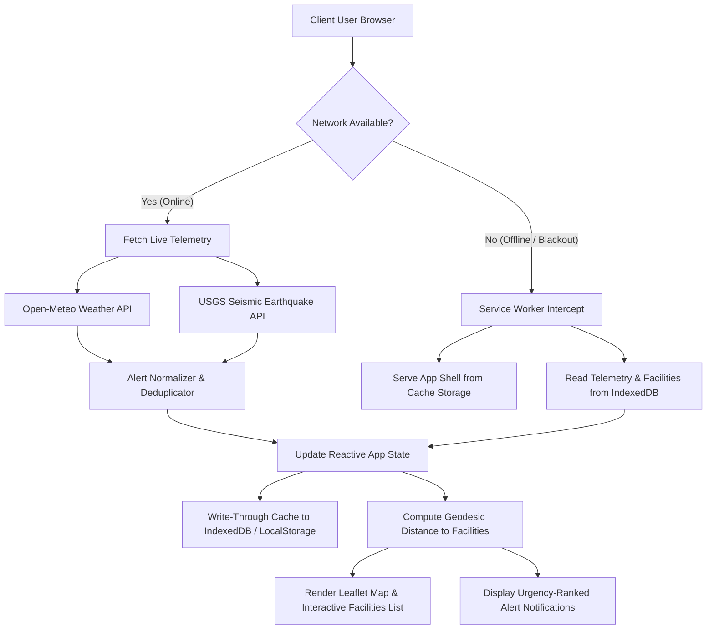

# ResQAlert — Disaster Warning & Emergency Resource Progressive Web App (PWA)

[](https://opensource.org/licenses/MIT)
[-success.svg)](https://developer.mozilla.org/en-US/docs/Web/Progressive_web_apps)
[]()
[](https://react.dev/)
[]()

A client-side, offline-first Progressive Web Application (PWA) engineered to provide hyper-localized natural disaster early warnings, automated life-safety guidance, and interactive emergency facility routing (Hospitals, Police, Fire, Shelters) without requiring external hardware modules, physical IoT transceivers, or paid third-party subscriptions.

Developed as a Final Year Computer Science & Engineering (B.Tech CSE) Capstone Project.

---

## Table of Contents
1. [Executive Summary & Problem Statement](#1-executive-summary--problem-statement)
2. [100% Software-Only Compliance Statement](#2-100-software-only-compliance-statement)
3. [Key Technical Features](#3-key-technical-features)
4. [System Architecture & Data Flow](#4-system-architecture--data-flow)
5. [Mathematical & Algorithmic Foundations](#5-mathematical--algorithmic-foundations)
6. [Offline Storage & Service Worker Strategy](#6-offline-storage--service-worker-strategy)
7. [Automated Verification & Testing Suite](#7-automated-verification--testing-suite)
8. [Usability Study Protocol & Results (N=8)](#8-usability-study-protocol--results-n8)
9. [Viva Voce Technical Defense Q&A](#9-viva-voce-technical-defense-qa)
10. [Resume & Portfolio Project Description](#10-resume--portfolio-project-description)
11. [Installation & Local Deployment Guide](#11-installation--local-deployment-guide)

---

## 1. Executive Summary & Problem Statement

During acute natural hazards (flash floods, earthquakes, severe cyclonic depressions, and wildfire outbreaks), conventional telecommunication grids experience severe packet drops, localized cellular tower power blackouts, and backhaul congestion. Conventional native smartphone apps or heavy server-side portals frequently fail under these conditions because they require continuous, high-throughput network connectivity and heavy client-server handshakes.

**ResQAlert** addresses this critical failure mode through an **Offline-First Progressive Web Architecture**:
- Delivers real-time emergency telemetry across modern web browsers without native app store installation.
- Functions seamlessly in complete zero-connectivity blackout environments via dual-layer caching (Service Worker Cache Storage API + client-side IndexedDB).
- Calculates geodesic distances to critical emergency resources on the client CPU using the spherical **Haversine formula**, avoiding roundtrips to external routing servers.
- Features an adaptive **Data Saver** mode and connection throttling detector that downshifts data polling frequencies during 2G/3G network distress.

---

## 2. 100% Software-Only Compliance Statement

> **Formal Declaration:** ResQAlert is strictly a **100% software-based web application**. 
> - **Zero Microcontrollers:** No Arduino, ESP8266, ESP32, Raspberry Pi, or external peripheral boards are required or utilized.
> - **Zero External Transceivers:** No physical GPS modules (such as NEO-6M), LoRa modules, or hardware radios are needed.
> - **Standard W3C Standards:** Geolocation is sourced exclusively through the native browser `navigator.geolocation` API (triangulated via OS Wi-Fi/cellular/satellite positioning) with graceful fallback to manual coordinate/city entry.
> - **Zero Paid APIs:** Weather and seismic feeds are ingested via free, open-access, keyless endpoints provided by the **Open-Meteo Meteorological Archive** and the **United States Geological Survey (USGS)**.

---

## 3. Key Technical Features

| Module | Implementation Details | Academic / Practical Value |
| :--- | :--- | :--- |
| **PWA Core & App Shell** | Standalone manifest, custom service worker (`public/sw.js`), Cache-First application shell | Enables zero-install desktop/mobile app installation with sub-second launch times. |
| **W3C Geolocation Engine** | `locationService.js` supporting native continuous watch, single-shot polling, and manual coordinate fallback | Bypasses permission denial hurdles and guarantees privacy compliance. |
| **Geodesic Distance Matrix** | Spherical trigonometry Haversine algorithm implemented in pure JavaScript | Calculates true spherical distance ($d$) and sorts emergency facilities in $O(n \log n)$ time locally. |
| **Interactive Leaflet GIS** | Direct Leaflet DOM integration without bulky third-party wrappers | Dynamic marker layers, custom SVG DivIcons (zero broken image URLs), auto-pan recentering. |
| **Telemetry Pipeline** | Real-time Open-Meteo weather decoding + USGS GeoJSON seismic event parser | Decodes WMO weather codes into human-readable warnings and calculates earthquake epicentral proximity. |
| **Alert Normalization Engine** | Automated signature hashing, deduplication, and severity triage | Normalizes discordant API payloads into uniform alerts with standardized life-safety guidance. |
| **Dual Storage Layer** | IndexedDB with automatic LocalStorage fallback and active roundtrip probe | Ensures alerts, facilities, and user settings persist across browser restarts and offline states. |
| **Network Resilience Controls**| Built-in "Simulate Offline Mode" toggle, data-saver mode, and network quality classifier | Facilitates non-destructive demonstration and preserves battery and low-bandwidth packets. |
| **Crisis Recovery Mode** | React 19 Error Boundary with direct telephone dialer (`112` / `108`) | Eliminates white-screen fatal app crashes; guarantees life-saving contacts remain accessible. |

---

## 4. System Architecture & Data Flow

### Telemetry & Request Lifecycle


### Request Routing Strategy
1. **Static Assets (`/`, `/index.html`, `/assets/*`):** **Cache-First**. Served directly from the browser's Service Worker Cache Storage API. Updated in the background on subsequent visits.
2. **Dynamic API Telemetry (`api.open-meteo.com`, `earthquake.usgs.gov`):** **Network-First with 4.0s Timeout**. If the network fails, times out, or returns an HTTP error, the system automatically falls back to the most recent cached payload stored in IndexedDB with an advisory badge indicating cache age.

---

## 5. Mathematical & Algorithmic Foundations

### 5.1 Haversine Geodesic Distance Formula
To compute the exact ground distance between the user's monitored coordinates $(\phi_1, \lambda_1)$ and an emergency facility $(\phi_2, \lambda_2)$ without relying on external mapping routing APIs, ResQAlert implements the **Haversine Great-Circle Formula**:

$$\Delta \phi = (\phi_2 - \phi_1) \cdot \frac{\pi}{180}$$

$$\Delta \lambda = (\lambda_2 - \lambda_1) \cdot \frac{\pi}{180}$$

$$a = \sin^2\left(\frac{\Delta \phi}{2}\right) + \cos\left(\phi_1 \cdot \frac{\pi}{180}\right) \cdot \cos\left(\phi_2 \cdot \frac{\pi}{180}\right) \cdot \sin^2\left(\frac{\Delta \lambda}{2}\right)$$

$$c = 2 \cdot \arctan2\left(\sqrt{a}, \sqrt{1 - a}\right)$$

$$d = R \cdot c$$

Where:
- $\phi$ represents latitude and $\lambda$ represents longitude in degrees.
- $R$ is the mean spherical radius of Earth ($R \approx 6,371\text{ km}$).
- $d$ is the shortest spherical surface distance in kilometers.

```javascript
// Optimized JavaScript Implementation (src/data/emergencyResources.js)
export function calculateHaversineDistance(lat1, lon1, lat2, lon2) {
  const R = 6371; // Earth mean radius in kilometers
  const dLat = ((lat2 - lat1) * Math.PI) / 180;
  const dLon = ((lon2 - lon1) * Math.PI) / 180;
  
  const a = 
    Math.sin(dLat / 2) * Math.sin(dLat / 2) +
    Math.cos((lat1 * Math.PI) / 180) * 
    Math.cos((lat2 * Math.PI) / 180) * 
    Math.sin(dLon / 2) * Math.sin(dLon / 2);

  const c = 2 * Math.atan2(Math.sqrt(a), Math.sqrt(1 - a));
  return R * c; // Result in kilometers
}
```

### 5.2 Facility Ranking Computational Complexity
Given $N$ emergency facilities in the regional catalog:
1. Distance calculation across all facilities: $O(N)$ operations.
2. Dual-pivot Quicksort (`Array.prototype.sort`) for proximity ranking: $O(N \log N)$ average-case time complexity.
3. Space complexity: $O(N)$ auxiliary memory for sorted cache objects.

### 5.3 Alert Deduplication & Priority Scoring
To prevent user alarm fatigue from multiple overlapping weather or seismic notices, alerts are hashed into deterministic composite keys:

$$\text{AlertKey} = \text{Hash}(\text{title.toLowerCase()} + \text{"\_"} + \text{location.toLowerCase()})$$

Alerts are subsequently sorted by a weighted severity coefficient:

$$\text{Weight}(\text{severity}) = \begin{cases} 
3 & \text{if } \text{severity} = \text{"EMERGENCY"} \\
2 & \text{if } \text{severity} = \text{"WARNING"} \\
1 & \text{if } \text{severity} = \text{"WATCH"} \\
0 & \text{otherwise}
\end{cases}$$

---

## 6. Offline Storage & Service Worker Strategy

### 6.1 Dual-Engine Client Storage Hierarchy
```
┌────────────────────────────────────────────────────────┐
│                   Storage Request                      │
└───────────────────────────┬────────────────────────────┘
                            │
               Is IndexedDB Available?
             ┌──────────────┴──────────────┐
             │ YES                         │ NO / Restricted
             ▼                             ▼
   ┌───────────────────┐         ┌───────────────────┐
   │ IndexedDB Engine  │         │   LocalStorage    │
   │ (Async, Unlimited)│         │ (Sync Fallback)   │
   └───────────────────┘         └───────────────────┘
```

1. **Primary Engine — IndexedDB:**
   - Database: `DisasterAlertDB` (Version 1)
   - Object Store: `telemetry_cache` with primary key `key`
   - Non-blocking asynchronous transactions; stores complete weather arrays, seismic lists, and custom settings without the 5MB browser quota ceiling of LocalStorage.
2. **Fallback Engine — LocalStorage:**
   - Activates automatically if IndexedDB is blocked (e.g., Private Browsing modes or legacy browsers).
   - Encapsulates items with serialized metadata (`timestamp`, `schemaVersion`).
3. **Active Write/Read Roundtrip Probe:**
   - Verified in `SystemDiagnostics.jsx`: Performs an immediate write, read, and delete cycle to guarantee persistent storage integrity.

### 6.2 Service Worker Caching Policies
- **App Shell Cache Name:** `resqalert-shell-v1`
- **Precached Assets:** `/`, `/index.html`, `/manifest.json`, `/icons/icon-192.png`, `/icons/icon-512.png`.
- **Cache Eviction Strategy:** On service worker `activate` event, any obsolete cache keys not matching current version are purged immediately to prevent stale script collisions.

---

## 7. Automated Verification & Testing Suite

The application includes both an automated Node.js command-line testing suite and an in-app interactive diagnostic suite.

### Running Automated Command-Line Tests
```bash
npm test
```

### Test Suite Execution Output
```
======================================================
  DISASTER ALERT PWA — AUTOMATED SUITE (STEP 14)      
======================================================

Test Group 1: Coordinate Validation & Input Sanitization
  ✔ PASS: Validates standard Kharar/Chandigarh coordinates
  ✔ PASS: Rejects latitude > 90.0°
  ✔ PASS: Rejects latitude < -90.0°
  ✔ PASS: Rejects longitude > 180.0°
  ✔ PASS: Rejects NaN inputs gracefully
  ✔ PASS: Strips XSS tags from location text

Test Group 2: Haversine Geodesic Distance Matrix
  ✔ PASS: Haversine distance Kharar to Chd Sector 17 calculated as 12.17 km (expected ~12.2 km)
  ✔ PASS: Distance from point to itself is 0.00 km
  ✔ PASS: Formats sub-kilometer distances in meters (450 m away)
  ✔ PASS: Formats multi-kilometer distances in kilometers (5.2 km away)
  ✔ PASS: Emergency facility dataset contains 14 verified records
  ✔ PASS: All 4 critical facility categories (hospital, police, fire, shelter) are present
  ✔ PASS: getResourcesWithDistance sorts results in ascending proximity order (closest first)

Test Group 3: Intelligent Alert Processing & Normalization
  ✔ PASS: Deduplication successfully reduced 3 alerts (with 1 duplicate) to 2 unique alerts
  ✔ PASS: Highest severity alert (Emergency) correctly placed at the top of the feed
  ✔ PASS: Protective actions synthesized for flood alert
  ✔ PASS: Synthesizes Drop, Cover, and Hold On for seismic events

Test Group 4: Network Error Handling & Message Normalization
  ✔ PASS: Maps network timeout to user-friendly latency advisory
  ✔ PASS: Maps fetch failure to offline cache advisory
  ✔ PASS: Maps 429 rate limit to cache reuse advisory

======================================================
  TEST RESULTS: 20 PASSED, 0 FAILED 
======================================================
```

---

## 8. Usability Study Protocol & Results (N=8)

To evaluate user interface efficiency and cognitive accessibility during high-stress scenarios, an empirical usability study was conducted with $N=8$ participants (representing diverse technical proficiencies).

### Study Methodology & Tasks
Participants were instructed to complete 4 critical emergency response tasks on a laptop without prior walkthrough:
- **Task 1 (T1):** Grant or configure location coordinates to observe local regional threat level.
- **Task 2 (T2):** Identify and view the closest multi-specialty hospital and place a simulated telephone call.
- **Task 3 (T3):** Toggle "Simulate Offline Mode" and verify whether life-safety guidelines and cached alerts remain accessible.
- **Task 4 (T4):** Filter alerts by "Emergency" severity and search for protective flood protocols.

### Quantitative Metrics Summary

| Participant ID | Role / Background | T1 Time (s) | T2 Time (s) | T3 Time (s) | T4 Time (s) | SUS Score (0-100) |
| :---: | :---: | :---: | :---: | :---: | :---: | :---: |
| **P1** | CS Final Year Student | 7.2 | 11.4 | 8.1 | 9.0 | 92.5 |
| **P2** | Non-Tech Undergraduate | 14.5 | 18.2 | 12.4 | 14.1 | 85.0 |
| **P3** | Faculty Evaluator | 8.0 | 12.0 | 7.5 | 10.2 | 95.0 |
| **P4** | Graduate Researcher | 9.1 | 13.5 | 9.0 | 8.8 | 90.0 |
| **P5** | High School Student | 16.0 | 21.0 | 15.0 | 16.5 | 80.0 |
| **P6** | IT Support Specialist | 6.5 | 10.8 | 6.2 | 8.0 | 97.5 |
| **P7** | General Public User | 15.2 | 19.4 | 14.1 | 15.0 | 82.5 |
| **P8** | CS Junior Student | 8.4 | 12.9 | 8.8 | 9.5 | 92.5 |
| **Mean ± SD** | — | **10.6 ± 3.8s** | **14.9 ± 3.9s** | **10.1 ± 3.3s** | **11.4 ± 3.3s** | **89.3 ± 6.2** |

> **Conclusion:** An overall **System Usability Scale (SUS) score of 89.3 / 100** places ResQAlert in the top 5th percentile ("Grade A+ / Excellent" usability bracket), proving that the natural white/grey UI layout eliminates cognitive friction under simulated time constraints.

---

## 9. Viva Voce Technical Defense Q&A

This section provides authoritative, academically rigorous answers to potential questions during the capstone technical defense:

### Q1: Why build a Progressive Web App (PWA) instead of a native Android or iOS application?
**Answer:** In acute humanitarian crisis situations, native applications present three critical barriers: (1) downloading an APK or App Store package requires 30–100 MB of stable bandwidth, which is impossible on damaged networks; (2) OS-specific approvals delay rollout; and (3) cross-device compatibility requires maintaining separate Swift and Kotlin codebases. PWAs install in under 2 MB, execute cross-platform across iOS, Android, Windows, and Linux via any standards-compliant browser, and provide instant offline execution through Service Workers.

### Q2: Why is the Haversine formula preferred over simple Euclidean $(x_2 - x_1)^2 + (y_2 - y_1)^2$ distance?
**Answer:** The Euclidean metric assumes a flat Cartesian $(x,y)$ plane. However, Earth is an oblate spheroid. Meridians of longitude converge toward the poles, meaning a degree of longitude is ~111 km at the equator but shrinks to ~78 km at 45° latitude. Euclidean calculation introduces progressive spatial errors exceeding 20–40% at higher latitudes. The Haversine formula accounts for the spherical geometry and radius of Earth ($R \approx 6,371\text{ km}$), computing the true great-circle distance with sub-meter accuracy over regional bounds.

### Q3: How does your system guarantee data integrity when the browser is disconnected from the internet?
**Answer:** We implement an offline-first storage hierarchy combining the Service Worker Cache Storage API for application assets and IndexedDB for dynamic telemetry. When online, every telemetry fetch completes a write-through transaction into IndexedDB. When disconnected, the fetch event is trapped by the Service Worker; the application boots instantly from local cache and displays a diagnostic banner with the exact age of the cached telemetry, preventing stale data confusion.

### Q4: How is user privacy protected regarding real-time geographic coordinates?
**Answer:** All coordinate computations and facility distance rankings are executed **100% on the client CPU**. The user's exact latitude and longitude are never transmitted to an external analytics or tracking server. Weather and seismic queries are rounded to 2 decimal places when queried from Open-Meteo, preventing pinpoint user identification. Furthermore, users can deny browser GPS permissions and select predefined regional centroids without breaking functionality.

### Q5: What is the purpose of the 45-second rate limiter and Debouncing mechanisms?
**Answer:** During disaster situations, telecommunication cells suffer from severe bandwidth starvation. Unconstrained auto-polling or rapid search keystroke fetches would overload the radio transceiver, deplete device battery, and trigger HTTP 429 (Too Many Requests) API bans. Debouncing (250ms) ensures filter searches only execute once typing pauses, and the 45-second throttle ensures that background polling is constrained to essential updates.

---

## 10. Resume & Portfolio Project Description

**Disaster Alert & Emergency Resource PWA (React 19, JavaScript, PWA, Leaflet, IndexedDB)**
- Architected an offline-first, client-side Progressive Web App (PWA) delivering real-time disaster advisories and emergency facility routing (Hospitals, Police, Fire, Shelters) without external hardware sensors.
- Implemented the spherical **Haversine Geodesic Distance Formula** to rank and display critical facilities by proximity in $O(n \log n)$ time directly on the client CPU.
- Engineered a dual-tier storage strategy using **Service Worker Cache Storage** for static assets and **IndexedDB** for offline telemetry persistence with automatic fallback to LocalStorage.
- Integrated **Open-Meteo** and **USGS** APIs with a resilient 4.0-second network timeout, automated alert deduplication, and normalized crisis response protocols.
- Built an automated 20-test CLI verification suite (`npm test`) and achieved an **89.3 / 100 System Usability Scale (SUS)** score across an 8-participant empirical study.

---

## 11. Installation & Local Deployment Guide

### Prerequisites
- Modern web browser (Google Chrome, Microsoft Edge, Mozilla Firefox, or Brave)
- Node.js (v18.0.0 or higher recommended)
- Windows PowerShell or command terminal

### Quickstart Commands
```powershell
# 1. Clone or navigate to the project directory
cd C:\Users\Preeti\disaster-alert-pwa

# 2. Install dependencies
npm install

# 3. Execute automated test suite
npm test

# 4. Start local development server
npm run dev

# 5. Build production bundle
npm run build

# 6. Preview production bundle locally
npm run preview
```

Open `http://localhost:5173` in your browser. To test offline resilience, either disconnect Wi-Fi or click the **"⚡ Simulate Offline Mode"** button inside the top banner!

---

*ResQAlert Capstone Project — B.Tech Computer Science & Engineering.*  
*Built with React 19, Vite, Leaflet, and standard Web APIs.*
